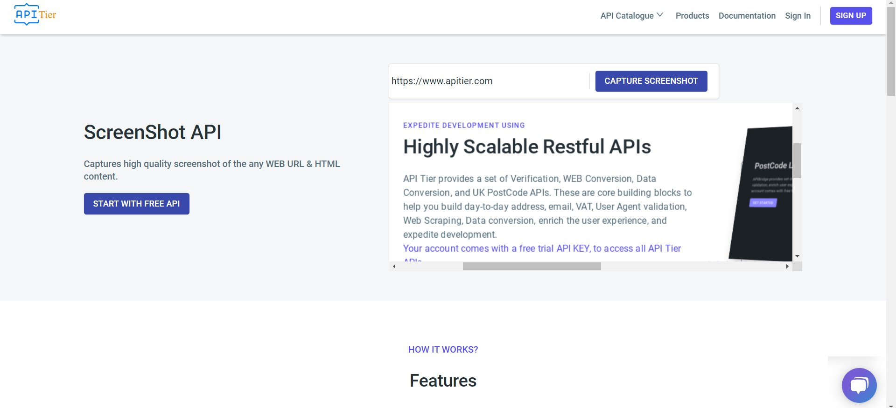

# Take Screenshots Easily with Our Powerful Screenshot API - Documentation | APITier

* Captures high-quality screenshots of any WEB URL & HTML content.
* ScreenShot API can be integrated with any website or mobile app which requires high-quality screenshots of any WEB URL & HTML content.

## Sample Request
* The ScreenShot API and its functionalities are configured to be used via HTTP POST.
* In ScreenShot API each API request is based at the following URL.  


```bash title="Example Curl Request" 
curl --location --request POST 'https://web.apitier.com/convert/url/to/png?x-api-key=2yYqylz5Ue3ixHxCEP30417NwVh5AMhEa8GRuipB' \
--header 'Content-Type: application/json' \
--data-raw '{
    "url": "https://www.apitier.com"
}'
```


### API request parameters

| Parameter                      | Type                 |    Description                      |
| --------------------           | -------------------- | --------------------------------   |
| x-api-key (required)           | String               |Your private unique API key to authenticate with the API.<br />You can generate it in your dashboard.<br />find it in your - [API dashboard](https://www.apitier.com/api/conversion/web-conversion)<br />Example: hv90CBlVBN9R6Tbfx4wsg3CxRTXyk9CA6bvx2f11 |
|url (required)                  | String               |The full URL ( including the HTTP Protocol - http:// or https:// ) of the website you want to captures screenshots of any WEB URL & HTML content. <br />Example: https://www.apitier.com     |


### Request Parameters

| Parameter                      | Type                 |    Description                            |
| --------------------           | -------------------- | ---------------------------------------   |
| inputFile: file (in formData) <br />(required) | String      |Input file to perform the operation on. <br />Returned data will always be in this field.   |

## Sample Response




### HTTP Response Headers

| Key                   | value                |    Description                            |
| --------------------  | -------------------- | ---------------------------------------   |
| Content-Type          | application/json     | The API supports requests in with the following content type: <br /> application/json        |
| 200 OK                | OK                   | The result of the request, it can be OK in case of success or error in case of failure|


### How to Use Our ScreenShot API
 * Enter or paste the URL in the input field.
 * For the processing to take place, click the button “CAPTURE SCREENSHOT”. The API will provide you the high-quality screenshots of any WEB URL & HTML content.


### Example
URL - https://www.apitier.com

* **Input Field**


<br /><br />

* **Output Field - screenshot of web url - https://www.apitier.com**


